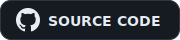

<h1 align="center">Hey, I'm Lawson Hart</h1>

Full-stack developer / engineer from the Dallas-Fort Worth Metroplex <i>I make things that solve very inadequate/self made issues (most of the time)</i>

  
  
  
  
  

 

<table align="center">
<tr>
<td align="center" width="500">
  
   
  a fresh puzzle every load — click for a solution to a similar puzzle
</td>
<td align="center" width="300">
  <h3> Shikaku</h3>
  
<em>Timed grid logic puzzle with leaderboards</em>

  designed, built, and hosted by me
    
  
    
  
</td>
</tr>
</table>

 

<!-- FEATURED_PROJECT_START -->

  <h3> Featured Project</h3>
  <strong>W3W Map</strong>
   
  A static GTA V map viewer with What3Words grid overlay and postal code search.
    
  
  &nbsp;&nbsp;
  

<!-- FEATURED_PROJECT_END -->
